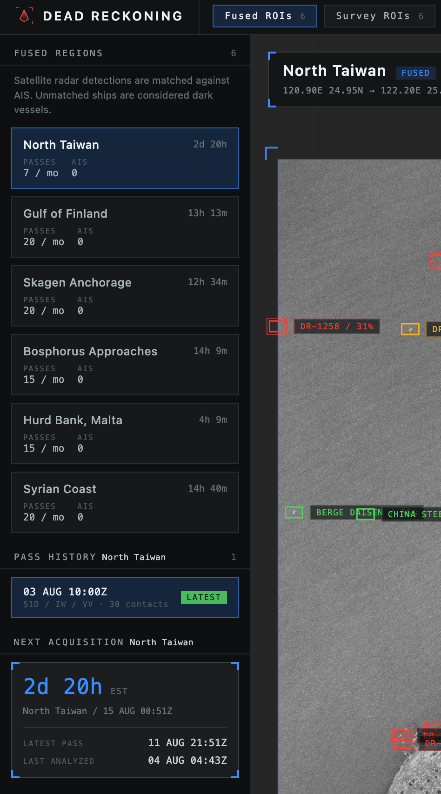
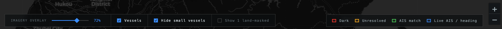
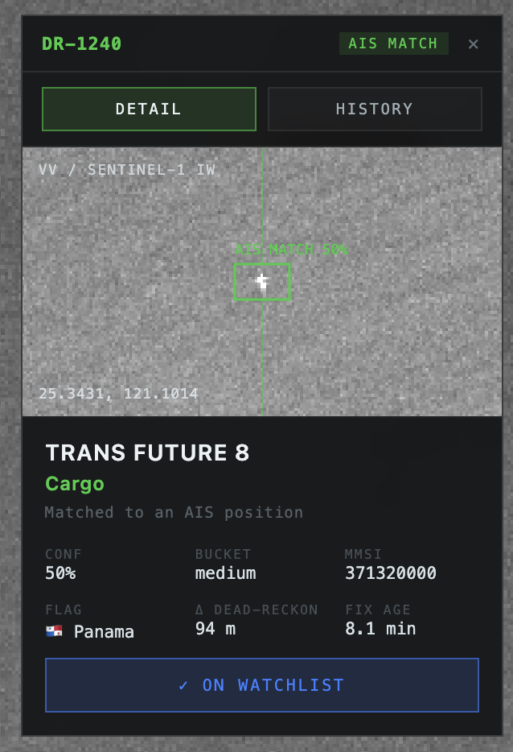

<p align="center">
  
</p>

<h1 align="center">Dead Reckoning</h1>

<p align="center"><strong>OSINT Dark vessel detection platform</strong></p>

<p align="center">
  <a href="https://dark-vessel.pruettfed.com"></a>
  
  
  
  
  
  
</p>

<p align="center">
  <b><a href="https://dark-vessel.pruettfed.com">▶ Open the live console</a></b>
</p>


The problem: Nearly every large ship at sea broadcasts its identity and position over AIS, a transponder system anyone can listen to. But, ships that switch it off (oil tankers, smugglers, unregistered fishing fleets, warships) vanish from tracking data.

But, radar satellites can still see these ships. **Dead Reckoning** pulls
Sentinel-1 radar imagery of twelve contested maritime regions, finds ships using a
computer-vision model, and checks each one against the live AIS feed. A ship the radar sees that nobody is broadcasting for is a **dark vessel**.

> Portfolio project. Every data source is public, free, and used within its terms.

---

## Features

### Two modes

**Fused** regions have AIS receiver coverage, so radar contacts can be checked against
broadcasting ships and called dark. **Survey** regions have no receiver coverage, but the radar can supplement the missing reciever data. Useful for watching for entire **dark regions**.

### Twelve regions

| Fused | Survey |
|---|---|
| North Taiwan | Strait of Hormuz |
| Gulf of Finland | Musandam Staging Area |
| Skagen Anchorage | Kharg Island Terminal |
| Bosphorus Approaches | Tompok Utara Anchorage |
| Hurd Bank, Malta | Kerch Strait |
| Syrian Coast | Northeast Somalia Coast |



### Map controls

Fade the radar overview in and out under the detections, show or hide live AIS vessels, hide
small craft, and reveal the land-masked contacts.



### Matching status

| | Meaning |
|---|---|
| 🔴 **Dark** | Radar saw a ship; no AIS broadcast accounts for it. |
| 🟢 **AIS match** | A broadcasting ship, dead-reckoned to this instant, lands on the contact. |
| 🟠 **Unresolved** | A candidate exists, but the evidence is too weak to call either way. |
| 🔵 **Contact** | Survey regions: a vessel was here, no claim about broadcasting. |
| 🟣 **Land-masked** | The contact fell on land — a rock or a pier. Excluded from every count. |

### Contact dossier

Identity, flag, ship type, and navigational status, plus the fusion evidence behind the
status: distance to the nearest AIS ship, the age of its last fix, and the radar displacement
allowed for. Includes history of ship and ability to watch.



### Detection model

YOLOv8 fine-tuned on xView3-SAR imagery via SARFish. The same sensor, resolution, and
calibration the pipeline fetches at 10 m/px, with labels derived from AIS and
analyst-verified. Inference tiles each scene at 800 px with global NMS, reducing every
prediction to a centroid and a confidence bucket. Training runbook:
[`ml/README.md`](ml/README.md).

---

## User guide

The console is three columns: **regions** on the left, the **map** in the middle,
**contacts** on the right.

**1. Pick a mode, then a region.** The top bar splits the twelve regions into **FUSED** and **SURVEY** . The left sidebar lists the regions of the current fleet with live vessel counts and a countdown to the next satellite pass.

**2. Watch live, or pick a pass.** With no pass selected you are looking at live AIS traffic
in that region. Select a pass from **PASS HISTORY** and everything freezes at that
acquisition instant. Click the selected pass again to return to live or the X next to SCENE ANALYSIS.

**3. Read the colors.**

| | Meaning |
|---|---|
| 🔴 **Dark** | Radar saw a ship here; no AIS broadcast can account for it. |
| 🟢 **AIS match** | A broadcasting ship, dead-reckoned to this instant, lands on this contact. |
| 🟠 **Unresolved** | A candidate exists but the evidence is too weak to call either way. |
| 🔵 **Live AIS** | A broadcasting vessel, arrow showing heading. Not a radar contact. |
| 🟣 **Land-masked** | A radar contact that fell on land — a rock or a pier, excluded from every count. |
| 🔵 **Contact** | Survey regions only: a vessel was here. No claim about broadcasting. |

**4. Tune the view.** Bottom-left controls: fade the radar imagery in and out, hide AIS
vessels, hide small craft (usually ommitted from detection), and reveal the land-masked contacts if you want to audit them.

**5. Open a contact.** Click any marker or any row in the right-hand rail. The dossier has a
**DETAIL** tab (identity and fusion evidence) and a **HISTORY** tab (every past sighting of
that ship). The star adds it to your watchlist, which is kept in your browser.

**6. Check the footer.** The bottom bar carries the scene's own quality numbers: contacts
found, contacts masked, the measured false-match rate, and recall against resolvable ships.
A high false-match rate is why a scene may show no dark calls at all, the pipeline refuses to guess.

---

## Tech stack

| Layer | Choices |
|---|---|
| **Backend** | Python 3.12, FastAPI, SQLAlchemy (async) + asyncpg, GeoAlchemy2, Pydantic Settings |
| **Database** | PostgreSQL 16 + PostGIS 3.4 |
| **Computer vision** | YOLOv8 (ultralytics), CPU inference, fine-tuned on Sentinel-1 GRD imagery |
| **Frontend** | Vite 5, React 18, TypeScript, react-leaflet, TanStack Query |
| **Data sources** | [AISStream](https://aisstream.io) WebSocket (AIS), [Copernicus CDSE](https://dataspace.copernicus.eu) Sentinel Hub Process API (SAR), OSM coastline (land mask) |
| **Infrastructure** | Docker Compose locally; Railway in production. One image serving API + SPA, PostGIS alongside |
| **Testing** | pytest (pure functions + `TestClient`, no DB, no network, no torch), vitest for frontend logic |

### How the pipeline fits together

```
AISStream WebSocket ──► PostGIS (continuous, all regions at once)
                                    │
Sentinel-1 catalog ──► footprint    │
      (free)           check        │
                          │         │
                    pixel fetch ──► YOLOv8 (tiled) ──► land mask ──► fusion ──► API ──► map
                     (metered)         centroids        geometric     PostGIS
```

Full detail in [`docs/architecture.md`](docs/architecture.md).

---

## Engineering highlights

**Ships move between updates, so every position is projected forward.** AIS updates arrive
about every three minutes. At 10 knots a ship travels most of a kilometre in that time, so
comparing its last reported position to a satellite image taken at some other moment matches
nothing. Every ship is instead moved forward along its course and speed to the exact second
the image was taken, and only then compared.

**The match distance is calculated, not picked.** Rather than one fixed "within 500 metres"
rule, each ship gets its own allowance, built from real sources of error: how precise the
position is, how far radar shifts a moving ship, and how far it could have drifted since its
last update. A fast ship gets more room, so ordinary traffic doesn't get called dark for
moving.

**Each image measures its own error rate.** Before anything is called dark, the system drops
test points on empty water and counts how often one lands close enough to an AIS ship to
count as a match by pure chance. If that happens too often, the water is too crowded to draw
conclusions from and every dark call is downgraded to unresolved. The rate is shown for each region.

**The pipeline refuses to pay for a bad image.** Satellite imagery is billed per request, and the
catalog passing over an ROI is not enough alone. A pass clipping one corner
costs full price and returns a mostly black image. Real coverage is measured before spending
anything, then checked again against the image that comes back. Every purchase is logged
before the request goes out, capped by a monthly limit, and never retried, so a crash
mid-request can't buy the same image twice.

**The detection model doesn't sit in memory.** Detection runs about 152 times a month, a few
minutes at a time. Keeping the model loaded the rest of the month was most of the hosting
bill. It now runs in a separate process that exits when it's done. Loading it only on demand
doesn't help, because Python never unloads a module once imported — only a process that
exits gives the memory back.

**A guard against the failure that looks like a success.** If the AIS feed dies, nothing
matches, the error-rate check finds no false matches (there is nothing left to falsely match
against), and the system confidently reports every ship in the image as dark. The result
looks sound and is completely wrong. Three separate checks now require six hours of
*uninterrupted* AIS, with no gap longer than thirty minutes, before an image may be compared
at all.

**The model was retrained for the imagery it actually sees.** The first version learned from
imagery ten to twenty times sharper than what this pipeline downloads, where a large ship
fills hundreds of pixels instead of about twenty. Retraining on imagery from the same
satellite, processed exactly the same way, is what made detections reliable. Runbook in
[`ml/README.md`](ml/README.md).

---

## Challenges

**Reliable public AIS data isn't free.** The commercial APIs cost hundreds of dollars a
month, and the free ones are land-based only, with data restrictions. Coverage stops at the
horizon of whatever volunteer antenna is nearby, and it fails quietly: ships past that line
just stop appearing, which reads as "dark" rather than "not covered". The solution was to
probe live AIS density methodically and pick the regions with genuinely good coverage,
sizing each one to where the data actually ends. Regions with poor AIS but useful satellite
coverage became survey regions instead. Method and results in
[`docs/ais-coverage.md`](docs/ais-coverage.md).

**Satellite imagery is free, but not unlimited.** Copernicus bills every image request
against a monthly quota, and larger areas cost more, so twelve regions imaged daily will
burn through a month quickly if placed carelessly. The unintuitive part is that *where* a
region sits matters more than how big it is. Shifting one region to line up with the
satellite's actual flight path took it from 3 usable images a month at 179 units each to 11
at 65 — cheaper and four times the data. Every region is priced with a free, catalog-only
script before it ships, and a test fails the build if the set ever goes over budget.

**Radar draws moving ships in the wrong place.** Radar satellites work out position partly
from the Doppler shift of the returning signal, so a moving ship is drawn offset from where
it really was (roughly 450 metres at 10 knots), in a direction that depends on its heading
and the satellite's. Ignore that and normal, honestly-broadcasting traffic reads as dark, so
it became part of the match calculation rather than something papered over with a bigger
radius.

**No public training set matched the imagery.** Most public radar ship datasets use very
high-resolution imagery, which teaches a model to look for hull shape and wake. This detail
does not exist at the resolution this pipeline downloads. The one usable dataset was
xView3-SAR: same satellite, same resolution, labels checked by analysts. Even then, its
labels are single points rather than boxes, and the brightness scaling had to be matched
exactly to the live pipeline, with a test asserting the two never drift apart.

**Land looks like ships.** At this resolution a breakwater, a rock, or a pier is a small
bright blob, indistinguishable from a small boat. What tells them apart is location, not
appearance, so it is settled against a coastline map instead of being asked of the model.
Those contacts are flagged rather than deleted, so the mask can be retuned at any time
without re-buying imagery.

---

## Quick start

**You need:** Docker Desktop, Node.js 20 + pnpm (`npm i -g pnpm`).

```bash
git clone https://github.com/pruettfed/dead-reckoning.git
cd dead-reckoning
make start-dr            # PostGIS + API + frontend, all in Docker
```

Then open **http://localhost:5173**. Check the API with:

```bash
curl http://localhost:8000/api/health
```

Other entry points:

```bash
make start-dr-backend    # database + API only
make start-dr-prod       # the single-origin production image, locally
make down-dr             # stop whichever stack is running
make help                # list them all
```

For faster frontend iteration, run Vite natively against the Dockerized backend:

```bash
cd frontend && pnpm install && pnpm dev     # :5173, proxies /api → :8000
```

### Turning on live data

Out of the box the app runs with an empty database. Copy `backend/.env.example` to
`backend/.env` and fill in:

1. **`AISSTREAM_API_KEY`** — free at [aisstream.io](https://aisstream.io). Without it there
   is no AIS to fuse against.
2. **`CDSE_CLIENT_ID`** / **`CDSE_CLIENT_SECRET`** — OAuth2 client credentials from
   [dataspace.copernicus.eu](https://dataspace.copernicus.eu), for satellite imagery.
3. **A detector checkpoint** at `backend/models/sar_ship.pt` — train one with
   [`ml/README.md`](ml/README.md) (free Colab GPU). The directory is volume-mounted, so no
   rebuild is needed. Without it the API and AIS ingest work fine and the entire radar half
   silently does nothing.

Analysis then runs **automatically**. A scheduler sweeps every region and analyzes each new
usable pass once, under a monthly spend ceiling. Nothing in the UI requests imagery. To
force a run while developing:

```bash
cd backend && .venv/bin/python scripts/analyze.py north_taiwan     # spends PU
```

### Tests

```bash
cd backend && .venv/bin/pytest      # no database, no network, no torch required
cd frontend && pnpm test
```

### Developer tools

Reset scenes, AIS, or the spend ledger while iterating — the CLI talks to the database
directly and needs no key:

```bash
cd backend
.venv/bin/python scripts/dev_reset.py pu --show
.venv/bin/python scripts/dev_reset.py scenes --roi north_taiwan --dry-run
.venv/bin/python scripts/dev_reset.py ais
```

> **Deleting scenes re-spends Processing Units** — the scheduler reads the pass as new and
> re-fetches it. Set `SCHEDULER_ENABLED=false` first if you don't want that.

Diagnose a stalled scheduler with `scripts/ais_health.py`, which prints exactly why any
region is being held. The same resets exist over HTTP at `/api/dev/*` for a remote
non-production deploy, behind `DEVTOOLS_ENABLED=true` and a `DEVTOOLS_API_KEY`.

---

## API

The public API is read-only, unauthenticated, and free. Full reference with response shapes:
[`docs/api.md`](docs/api.md). Interactive Swagger at `/docs` — served only outside
production.

| Endpoint | Returns |
|---|---|
| `GET /api/health` | Liveness, deployed version, and per-source state for AIS and the SAR connector |
| `GET /api/status-message` | The operator announcement banner, if one is posted |
| `GET /api/rois` | The twelve regions: boxes, mode, revisit rate, written brief |
| `GET /api/vessels?roi=` | Latest AIS position per vessel (`?at=` for a historical instant) |
| `GET /api/vessels/count?roi=` | Vessel count for a region |
| `GET /api/vessels/{mmsi}/track` | Recent track history for one vessel |
| `GET /api/scenes?roi=` | Analyzed satellite passes with per-scene quality metrics |
| `GET /api/scenes/{id}/overview.png` | The stored radar overview image |
| `GET /api/scenes/{id}/detections` | Radar contacts with fusion state and evidence |
| `GET /api/analysis/next-pass` | Countdown to the next expected acquisition |
| `GET /api/analysis/schedule` | Cross-region scheduler state |

Two route groups **do not exist in production** — they return 404 there with or without a
valid key, and never appear in the schema:

| Endpoint | Why it's gated |
|---|---|
| `POST /api/analysis/{roi}` | Spends Processing Units. Bypasses the monthly ceiling, and a scene that fails after its fetch is re-bought on every call. |
| `/api/dev/*` | Destructive resets. |

Every response is filtered through a declared model, and error text is redacted of secrets
*before it is stored*, not just before it is served.

---

## Releases

The `main` branch is what is deployed.

| Change | Bump |
|---|---|
| Release branch `vN.M` merged to `main` | minor — `1.4.0` → `1.5.0` |
| Hotfix straight onto `main` | patch — `1.5.0` → `1.5.1` |
| Breaking API change | major — `1.5.1` → `2.0.0` |

### Release history

| Version | Last commit | Date | Contents |
|---|---|---|---|
| `1.0.0` | `bd88a3a` | 2026-08-05 | First deploy |
| `1.1.0` | `28ccaf8` | 2026-08-06 | Deploy hardening, scheduler AIS warm-up gate, ROI labels, status badges |
| `1.1.1` | `dc5a879` | 2026-08-08 | Icons, wording, AIS ingest backoff reset |
| `1.2.0` | `8d2b406` | 2026-08-11 | Status message system: `GET /api/status-message`, table, CLI, banner |
| `1.3.0` | `1086c00` | 2026-08-14 | `transfer_scenes` export/import between databases |
| `1.4.0` | `f800993` | 2026-08-17 | Version constant, stub mode, top/status bar split by scope |

Ask a running instance what version it is:

```bash
curl -s https://<host>/api/health | jq .version
```

## Deployment

Production runs on **Railway as two services**: `web` (this image) and `db`
(`postgis/postgis:16-3.4` with a volume at `/var/lib/postgresql/data`). Railway's stock
Postgres has no PostGIS, which is not optional here.

The image builds the SPA and serves it from the API process, so there is **one origin and
one public hostname**. That is the security decision, not a convenience: the browser never
makes a cross-origin request, and the API has no address of its own for anyone to find.

### Before the first deploy

1. Commit the detector checkpoint at `backend/models/sar_ship.pt` — `.gitignore` allows that
   one path. Without it the scheduler reports `idle: model checkpoint not found`.
2. Point your domain at the `web` service. Railway issues a CNAME and TXT record and
   provisions TLS itself.

### Environment variables on `web`

```
ENV=production
DATABASE_URL=${{Postgres.DATABASE_URL}}     # Railway reference; the scheme is normalized
CORS_ORIGINS=https://[dark-vessel.pruettfed.com]
ALLOWED_HOSTS=dark-vessel.pruettfed.com
AISSTREAM_API_KEY=...
CDSE_CLIENT_ID=...
CDSE_CLIENT_SECRET=...
LOG_LEVEL=INFO
```

Do **not** copy `.env.example` verbatim — it sets `DEVTOOLS_ENABLED=true`, and
`ENV=production` refuses to boot with that. The refusal is the feature.

`ENV` selects the posture and **defaults to `production`**, so a forgotten value fails
closed:

| | `development` / `staging` | `production` |
|---|---|---|
| `/docs`, `/redoc`, `/openapi.json` | served | **404** |
| CORS | all methods | `GET`, `OPTIONS` only |
| `/api/dev/*` reset endpoints | available when enabled | **never registered** |
| `POST /api/analysis/{roi}` (spends PU) | available | **never registered** |
| `DEVTOOLS_ENABLED=true` | allowed | **refuses to boot** |
| `ANALYSIS_API_KEY` under 32 chars | allowed | **refuses to boot** |

### First boot

The app waits for Postgres, creates the PostGIS extension and tables, and loads the bundled
coastline. The scheduler then holds regions until AIS is healthy: **fused** regions wait for
six hours of *continuous* AIS with no cap, since fusing against a stale buffer calls
everything dark; **survey** regions wait the same six hours but are released after eight
regardless, so a deployment with no AIS key still produces imagery. Expect the region rail
to read "AIS warm-up" until then. A redeploy onto a populated database starts immediately.

### Operating it

```bash
railway link                                       # once, select project + web service
railway ssh keys add                                # once, register a key for `railway ssh`

# Force an analysis (the only way in production — no HTTP route can spend PU)
railway ssh -- bash -c 'cd /app && python scripts/analyze.py north_taiwan'

# Post a banner across the top of the console
railway ssh -- bash -c 'cd /app && python scripts/status_message.py post "Investigating AIS ingest delay" --level warning'
railway ssh -- bash -c 'cd /app && python scripts/status_message.py post "CDSE outage, no new passes" --level critical --title "OUTAGE"'
railway ssh -- bash -c 'cd /app && python scripts/status_message.py toggle'   # flip active/inactive, keep the text
railway ssh -- bash -c 'cd /app && python scripts/status_message.py clear'
railway ssh -- bash -c 'cd /app && python scripts/status_message.py show'

# Why is a region being held?
railway ssh -- bash -c 'cd /app && python scripts/ais_health.py'
```

**Use `railway ssh`, not `railway run`, for anything above.** `DATABASE_URL` on this
deployment points at `db.railway.internal`, which only resolves inside Railway's private
network — `railway run` executes the command on your own machine with the env vars injected,
so it can set `DATABASE_URL` but can never resolve or reach that host, and fails with a DNS
error (`nodename nor servname provided`) before it gets anywhere near the database.
`railway ssh` instead executes the command inside the running container itself, where that
hostname is real. First use needs an SSH key registered (`railway ssh keys add`, or
`railway ssh keys github` to import from GitHub) and, the very first connection, a host key
accepted for `ssh.railway.com` (accept the prompt, or pre-trust it with
`ssh-keyscan -H ssh.railway.com >> ~/.ssh/known_hosts`).

Status message levels are `info` (blue), `warning` (amber), and `critical` (red); `--title`
replaces the badge word with up to 24 characters of your own. The frontend polls every 30
seconds, so it appears without a redeploy. There is deliberately no HTTP write path in any
environment.

### Cost

The registry runs ~152 analyses a month, about 13 hours of work. Because detection runs in a
subprocess that exits, torch is resident for that 1.7% rather than all month (roughly
$8.50/mo). Loading the model in the API process undoes it; see
`backend/app/detect_worker.py`.

---

## Configuration reference

Compose sets the first few automatically. For native development and for all secrets, copy
`backend/.env.example` → `backend/.env`.

| Variable | Default | Description |
|---|---|---|
| `DATABASE_URL` | set by Compose | Async Postgres connection string (a plain `postgresql://` URL is normalized) |
| `ENV` | `production` | `development`, `staging`, or `production` |
| `CORS_ORIGINS` | set by Compose | Comma-separated allowed origins |
| `AISSTREAM_API_KEY` | — | AIS WebSocket key; ingest is disabled without it |
| `AIS_RETENTION_DAYS` | `5` | Rolling AIS history window |
| `CDSE_CLIENT_ID` / `CDSE_CLIENT_SECRET` | — | Copernicus OAuth2 credentials for pixel fetch |
| `SCHEDULER_ENABLED` | `true` | Master switch for automatic analysis |
| `SCHEDULER_WARMUP_HOURS` | `6` | Continuous AIS required before fusing; `0` disables the gate |
| `SCHEDULER_AIS_GAP_MINUTES` | `30` | Silence that counts as a break in the AIS stream |
| `PU_MONTHLY_CEILING` | `25000` | Hard cap on scheduled imagery spend, under the 30,000 free budget |
| `MODEL_PATH` | `models/sar_ship.pt` | YOLOv8 checkpoint path |
| `ANALYSIS_API_KEY` | — | Gates `POST /api/analysis/{roi}`; non-production only, ≥32 chars |
| `DEVTOOLS_ENABLED` | `false` | Register `/api/dev/*`. Forbidden when `ENV=production` |
| `DEVTOOLS_API_KEY` | — | Gates `/api/dev/*`; ≥32 chars or the router is skipped |

The complete contract lives in [`backend/.env.example`](backend/.env.example).

---

## Documentation

| Document | Contents |
|---|---|
| [`docs/architecture.md`](docs/architecture.md) | Pipeline internals and full file map |
| [`docs/api.md`](docs/api.md) | Endpoint reference with response shapes |
| [`docs/ais-coverage.md`](docs/ais-coverage.md) | How AIS coverage was probed per region, and what it found |
| [`ml/README.md`](ml/README.md) | Why xView3/SARFish, and the Colab fine-tuning runbook |

---

## Acknowledgements

Built entirely on public data and published research.

- **AIS positions** — [AISStream](https://aisstream.io), a free real-time AIS WebSocket feed.
- **SAR imagery** — Contains modified Copernicus Sentinel data, via the
  [Copernicus Data Space Ecosystem](https://dataspace.copernicus.eu) (European Space Agency).
- **Coastline** — OpenStreetMap contributors, via the OSM water polygons export.
- **Detection model training data** — the YOLOv8 checkpoint was fine-tuned on:
  - Cao, T.-T., Luckett, C., Williams, J., Cooke, T., Yip, B., Rajagopalan, A., Wong, S.
    "SARFish: Space-Based Maritime Surveillance Using Complex Synthetic Aperture Radar
    Imagery." *2022 International Conference on Digital Image Computing: Techniques and
    Applications (DICTA)*, IEEE.
    [doi:10.1109/DICTA56598.2022.10034640](https://doi.org/10.1109/DICTA56598.2022.10034640).
    Dataset (Apache 2.0):
    [ConnorLuckettDSTG/SARFish](https://huggingface.co/datasets/ConnorLuckettDSTG/SARFish).
  - Paolo, F., Lin, T.-t. T., Gupta, R., Goodman, B., Patel, N., Kuster, D., Kroodsma, D.,
    Dunnmon, J. "xView3-SAR: Detecting Dark Fishing Activity Using Synthetic Aperture Radar
    Imagery." *NeurIPS 2022 Datasets and Benchmarks Track*.
    [arXiv:2206.00897](https://arxiv.org/abs/2206.00897). Challenge hosted by the Defense
    Innovation Unit and Global Fishing Watch: [iuu.xview.us](https://iuu.xview.us).
